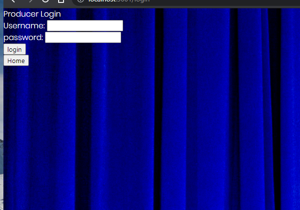

21 June 2021

# The Velvet Soap Box - Project Two

Trilogy/ UWA - Full Flex Bootcamp (February 2021)

Ricky Gobby, Dannielle Wilton, Jacob Hegan

[Heroku Deployment](https://event-woo-serotonin-seekers.herokuapp.com/)

[GitHub Repository](https://github.com/Serotonin-Seekers/Evento2)

[Presentation Slides](https://docs.google.com/presentation/d/1qzrrYmGCNNRJHp-rD_4mxemecABFWR4aL8QNxkXco0w/edit?usp=sharing)

[Press-Release-producer](./marketing/pressrelease-producer.md)

[Press-Release-attendees](./marketing/press-release-attendees.md)

---

## Description

The Velvet Soap Box is a website where independent producers, promoters and artists can list their event, and people who love to go to events can browse local independent events.

## Table of Contents

- [Usage](#usage)
- [Installation](#installation)
- [Future Iterations](#future-iterations)
- [Contributors](#contributors)
- [Screenshots](#screenshots)
- [License](#license)

## Usage

Independent producers, promoters and artists create an account on The Velvet Soap Box. Once they have created an account, they are able to log into their account. Once logged in they then select the "add event" option on the Events drop down button. There, they are taken to a page where they enter the details of the event. Once the event details are entered, they can submit event. They can then view events, found also on the Events drop down button. There they are taken to a page that displays all the events that have been listed. You can then click the event and view the details of the event, where you will find a link to the ticketing website.
People who are looking for an event to attend can browse the events listed without creating an account.

## Installation

If running this locally, within the repository direcrtory file in bash:

- npm i
  To install the necessary dependencies within package-json

- npm start
  To start the server on Port 3001 - http://localhost:3001/

## Future Iterations

We have struggled to implement the sessions. Attempting to utilise the
[Passport](https://www.npmjs.com/package/passport) and [Passport-Local](https://www.npmjs.com/package//passport-local) strategy where logging in stores a cookie. When logging out, there is no loggedIn property to refer to. We also have to update the styling - This will be updated in future iterations

## Contributors

[Jacob Hegan](https://github.com/heganjr)

[Dannielle Wilton](https://github.com/DanniWilton)

[Ricky Gobby](https://github.com/Au-RiZeR)

## Screenshots

## License

[MIT](https://choosealicense.com/licenses/mit/)

MIT License

Copyright (c) [2021] [Serotonin-Seekers]

Permission is hereby granted, free of charge, to any person obtaining a copy
of this software and associated documentation files (the "Software"), to deal
in the Software without restriction, including without limitation the rights
to use, copy, modify, merge, publish, distribute, sublicense, and/or sell
copies of the Software, and to permit persons to whom the Software is
furnished to do so, subject to the following conditions:

The above copyright notice and this permission notice shall be included in all
copies or substantial portions of the Software.

THE SOFTWARE IS PROVIDED "AS IS", WITHOUT WARRANTY OF ANY KIND, EXPRESS OR
IMPLIED, INCLUDING BUT NOT LIMITED TO THE WARRANTIES OF MERCHANTABILITY,
FITNESS FOR A PARTICULAR PURPOSE AND NONINFRINGEMENT. IN NO EVENT SHALL THE
AUTHORS OR COPYRIGHT HOLDERS BE LIABLE FOR ANY CLAIM, DAMAGES OR OTHER
LIABILITY, WHETHER IN AN ACTION OF CONTRACT, TORT OR OTHERWISE, ARISING FROM,
OUT OF OR IN CONNECTION WITH THE SOFTWARE OR THE USE OR OTHER DEALINGS IN THE
SOFTWARE.
